# BertWithPretrained

\[[中文](README-zh-CN.md)|[English](README.md)\]

本项目是一个基于PyTorch从零实现的BERT模型及相关下游任务示例的代码仓库，同时也包含了BERT模型以及每个下有任务原理的详细讲解。

[BERT: Pre-training of Deep Bidirectional Transformers for Language Understanding](https://arxiv.org/abs/1810.04805)

在学习使用本项目之前需要清楚Transformer的相关原理，更多关于Transformer内容的介绍可以参考文章[ This post is all you need（上卷）——层层剥开Transformer](https://mp.weixin.qq.com/s/uch_AGcSB8OSAeVu2sme8A) ，近4万余字、50张图、3个实战示例（[翻译](https://github.com/moon-hotel/TransformerTranslation) 、[分类](https://github.com/moon-hotel/TransformerClassification) 、[对联生成](https://github.com/moon-hotel/TransformerCouplet) ），带你一网打尽Transformer！

经过几个月磨磨蹭蹭地梳理，掌柜总算是把整个BERT模型的基本原理、代码实现以及原论文中所提到的5个微调任务场景都给详细地介绍了一遍，总计近8万字。完整PDF点击此处[ This post is all you need（下卷）——步步走进BERT模型](https://mp.weixin.qq.com/s/cBrP5XhuUIL4BOdjyEMrHg) 获取！


### [坚持的力量！《跟我一起学机器学习》上市了! 送礼65份！](https://mp.weixin.qq.com/s/p0cAZsVqX-rV7KBY9h0VmQ)

### 购买链接：[当当网](http://product.dangdang.com/29447673.html) &nbsp; [京东](https://item.jd.com/13335981.html)

 ## 模型详细解析
- [x] [1. BERT原理与NSP和MLM](https://www.ylkz.life/deeplearning/p10631450/) <br>
- [x] [2. 从零实现BERT网络模型](https://www.ylkz.life/deeplearning/p10602241/) 　　　[代码](model/BasicBert)
- [x] [3. 基于BERT预训练模型的中文文本分类任务](https://www.ylkz.life/deeplearning/p10979382/) 　　　[代码](Tasks/TaskForSingleSentenceClassification.py)
- [x] [4. 基于BERT预训练模型的英文文本蕴含(MNLI)任务](https://www.ylkz.life/deeplearning/p10407402/) 　　　[代码](Tasks/TaskForPairSentenceClassification.py)
- [x] [5. 基于BERT预训练模型的英文多选项(SWAG)任务](https://mp.weixin.qq.com/s/GqsbMBNt9XcFIjmumR04Pg) 　　　[代码](Tasks/TaskForMultipleChoice.py)
- [x] [6. 基于BERT预训练模型的英文问答(SQuAD)任务](https://www.ylkz.life/deeplearning/p10265968/) 　　　[代码](Tasks/TaskForSQuADQuestionAnswering.py)
- [x] [7. 基于NSP和MLM任务从头训练BERT任务](https://mp.weixin.qq.com/s/2Vtxv1Wj9knEFKUyUeQ_6w) 　　　[代码](Tasks/TaskForPretraining.py)
- [x] [8. 基于BERT预训练模型的命名体识别任务](https://mp.weixin.qq.com/s/bbeN95mlLaE05dFndUAxgA) 　　　[代码](Tasks/TaskForChineseNER.py)

## 工程结构
- `bert_base_chinese`目录中是BERT base中文预训练模型以及配置文件

    模型下载地址：https://huggingface.co/bert-base-chinese/tree/main
- `bert_base_uncased_english`目录中是BERT base英文预训练模型以及配置文件

    模型下载地址：https://huggingface.co/bert-base-uncased/tree/main
    
    注意：`config.json`中需要添加`"pooler_type": "first_token_transform"`这个参数
- `data`目录中是各个下游任务所使用到的数据集
    - `SingleSentenceClassification`是今日头条的15分类中文数据集；
    - `PairSentenceClassification`是MNLI（The Multi-Genre Natural Language Inference Corpus, 多类型自然语言推理数据库）数据集；
    - `MultipeChoice`是SWAG问题选择数据集
    - `SQuAD`是斯坦福大学开源的问答数据集1.1版本
    - `WikiText`是维基百科英文语料用于模型预训练
    - `SongCi`是宋词语料用于中文模型预训练
    - `ChineseNER`是用于训练中文命名体识别的数据集
- `model`目录中是各个模块的实现
    - `BasicBert`中是基础的BERT模型实现模块
        - `MyTransformer.py`是自注意力机制实现部分；
        - `BertEmbedding.py`是Input Embedding实现部分；
        - `BertConfig.py`用于导入开源的`config.json`配置文件；
        - `Bert.py`是BERT模型的实现部分；
    - `DownstreamTasks`目录是下游任务各个模块的实现
        - `BertForSentenceClassification.py`是单标签句子分类的实现部分；
        - `BertForMultipleChoice.py`是问题选择模型的实现部分；
        - `BertForQuestionAnswering.py`是问题回答（text span）模型的实现部分；
        - `BertForNSPAndMLM.py`是BERT模型预训练的两个任务实现部分；
        - `BertForTokenClassification.py`是字符分类（如：命名体识别）模型的实现部分；
- `Task`目录中是各个具体下游任务的训练和推理实现
    - `TaskForSingleSentenceClassification.py`是单标签单文本分类任务的训练和推理实现，可用于普通的文本分类任务；
    - `TaskForPairSentence.py`是文本对分类任务的训练和推理实现，可用于蕴含任务（例如MNLI数据集）；
    - `TaskForMultipleChoice.py`是问答选择任务的训练和推理实现，可用于问答选择任务（例如SWAG数据集）；
    - `TaskForSQuADQuestionAnswering.py`是问题回答任务的训练和推理实现，可用于问题问答任务（例如SQuAD数据集）；
    - `TaskForPretraining.py`是BERT模型中MLM和NSP两个预训练任务的实现部分，可用于BERT模型预训练；
    - `TaskForChineseNER.py`是基于BERT模型的命名体任务训练和推理部分的实现；
- `test`目录中是各个模块的测试案例
- `utils`是各个工具类的实现
    - `data_helpers.py`是各个下游任务的数据预处理及数据集构建模块；
    - `log_helper.py`是日志打印模块；
    - `creat_pretraining_data.py`是用于构造BERT预训练任务的数据集；

## 环境
Python版本为3.6，其它相关包的版本如下：
```python
torch==1.5.0
torchtext==0.6.0
torchvision==0.6.0
transformers==4.5.1
numpy==1.19.5
pandas==1.1.5
scikit-learn==0.24.0
tqdm==4.61.0
```
## 使用方式
### Step 1. 下载数据 
下载完成各个数据集以及相应的BERT预训练模型（如果为空），并放入对应的目录中。具体可以查看每个数据（`data`)目录下的`README.md`文件。
### Step 2. 运行模型 
进入`Tasks`目录，运行相关模型.
### 2.1 中文文本分类任务

模型结构与数据处理：

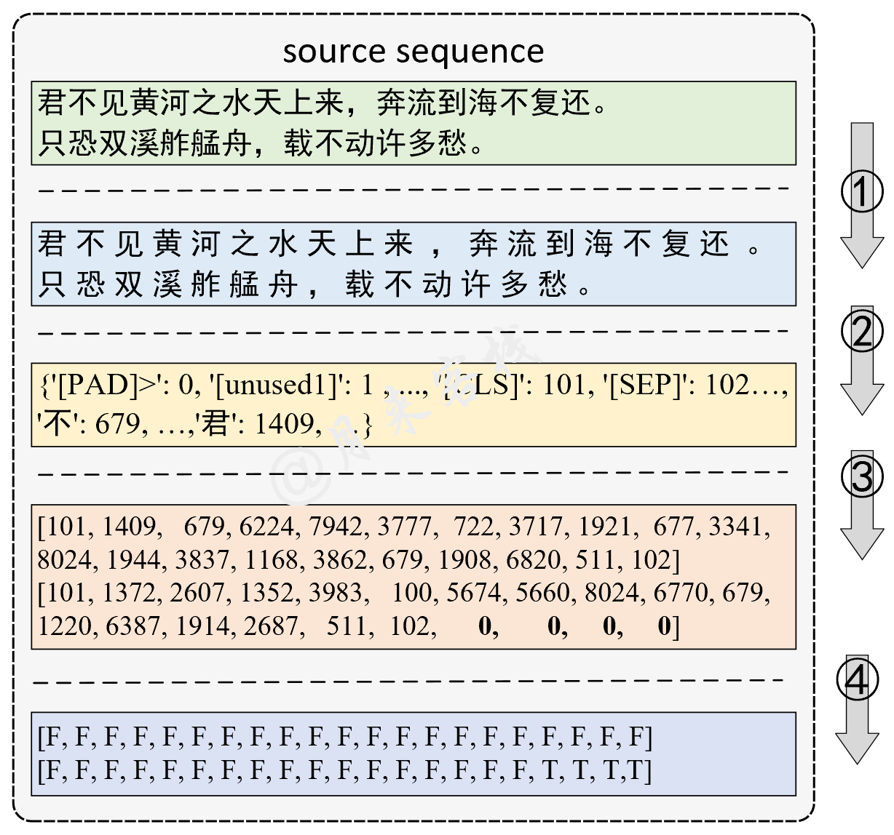

```python
python TaskForSingleSentenceClassification.py
```

运行结果:

```python
-- INFO: Epoch: 0, Batch[0/4186], Train loss :2.862, Train acc: 0.125
-- INFO: Epoch: 0, Batch[10/4186], Train loss :2.084, Train acc: 0.562
-- INFO: Epoch: 0, Batch[20/4186], Train loss :1.136, Train acc: 0.812        
-- INFO: Epoch: 0, Batch[30/4186], Train loss :1.000, Train acc: 0.734
...
-- INFO: Epoch: 0, Batch[4180/4186], Train loss :0.418, Train acc: 0.875
-- INFO: Epoch: 0, Train loss: 0.481, Epoch time = 1123.244s
...
-- INFO: Epoch: 9, Batch[4180/4186], Train loss :0.102, Train acc: 0.984
-- INFO: Epoch: 9, Train loss: 0.100, Epoch time = 1130.071s
-- INFO: Accurcay on val 0.884
-- INFO: Accurcay on val 0.888
```

### 2.2 英文文本蕴含任务

模型结构与数据处理：

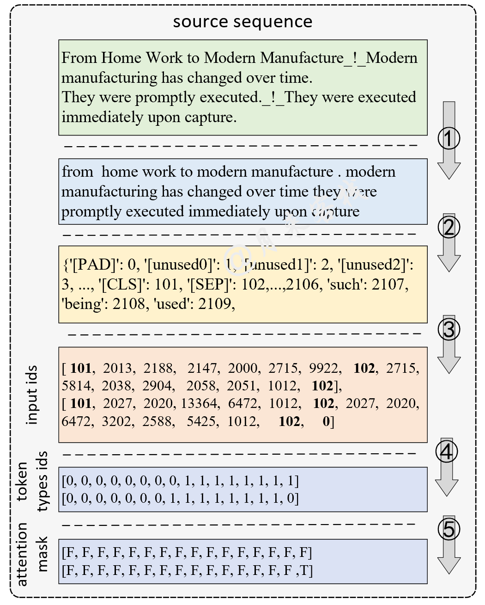

```python
python TaskForPairSentenceClassification.py
```

运行结果:

```python
-- INFO: Epoch: 0, Batch[0/17181], Train loss :1.082, Train acc: 0.438
-- INFO: Epoch: 0, Batch[10/17181], Train loss :1.104, Train acc: 0.438
-- INFO: Epoch: 0, Batch[20/17181], Train loss :1.129, Train acc: 0.250     
-- INFO: Epoch: 0, Batch[30/17181], Train loss :1.063, Train acc: 0.375
...
-- INFO: Epoch: 0, Batch[17180/17181], Train loss :0.367, Train acc: 0.909
-- INFO: Epoch: 0, Train loss: 0.589, Epoch time = 2610.604s
...
-- INFO: Epoch: 9, Batch[0/17181], Train loss :0.064, Train acc: 1.000
-- INFO: Epoch: 9, Train loss: 0.142, Epoch time = 2542.781s
-- INFO: Accurcay on val 0.827
-- INFO: Accurcay on val 0.830
```

### 2.3 SWAG多项选择任务

模型结构与数据处理：

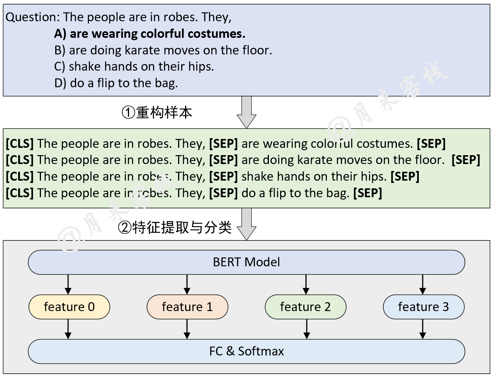

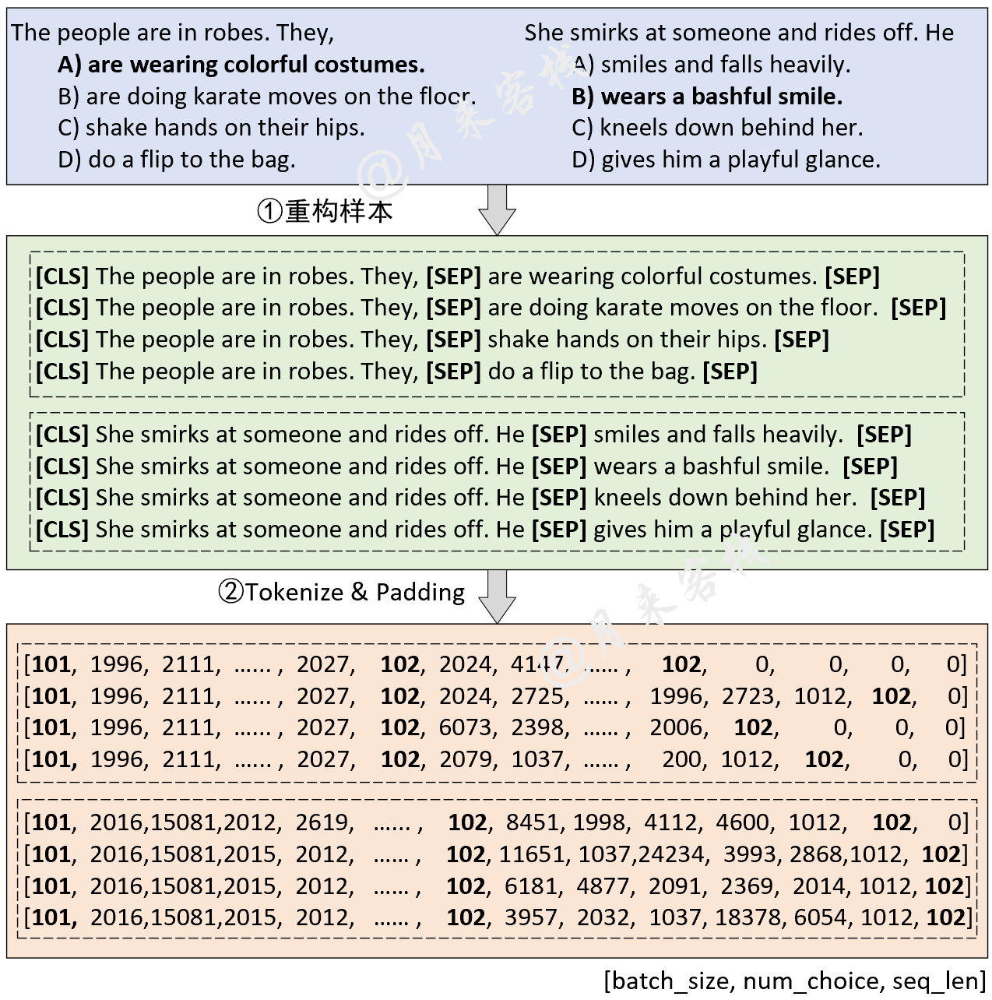

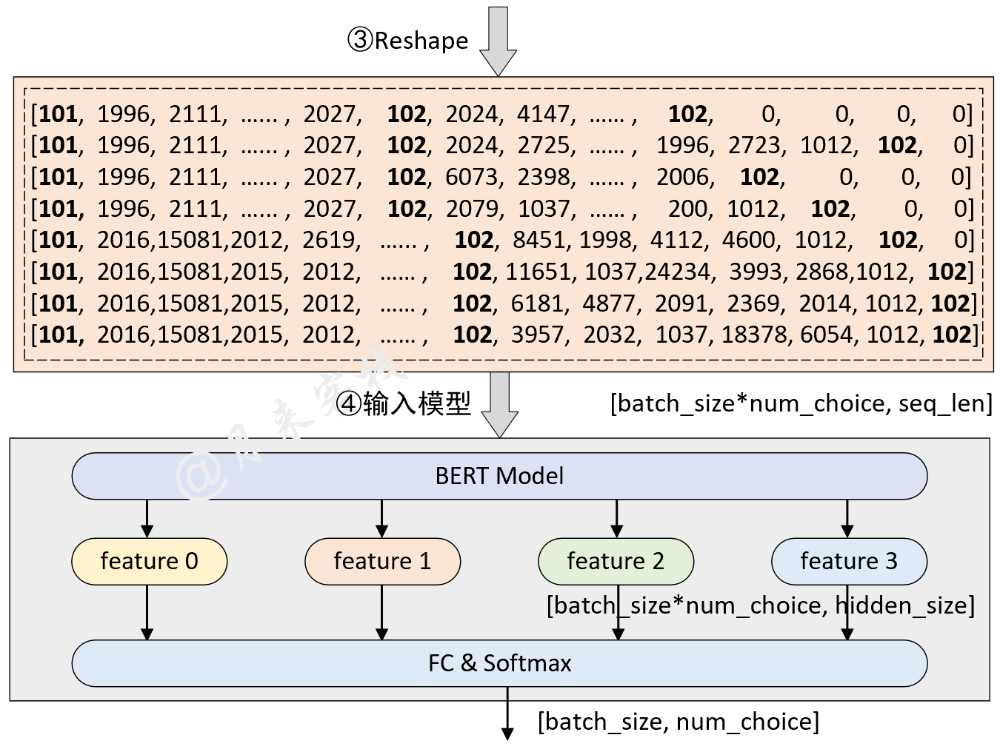

```python
python TaskForMultipleChoice.py
```

运行结果：
```python
[2021-11-11 21:32:50] - INFO: Epoch: 0, Batch[0/4597], Train loss :1.433, Train acc: 0.250
[2021-11-11 21:32:58] - INFO: Epoch: 0, Batch[10/4597], Train loss :1.277, Train acc: 0.438
[2021-11-11 21:33:01] - INFO: Epoch: 0, Batch[20/4597], Train loss :1.249, Train acc: 0.438
        ......
[2021-11-11 21:58:34] - INFO: Epoch: 0, Batch[4590/4597], Train loss :0.489, Train acc: 0.875
[2021-11-11 21:58:36] - INFO: Epoch: 0, Batch loss :0.786, Epoch time = 1546.173s
[2021-11-11 21:28:55] - INFO: Epoch: 0, Batch[0/4597], Train loss :1.433, Train acc: 0.250
[2021-11-11 21:30:52] - INFO: He is throwing darts at a wall. A woman, squats alongside flies side to side with his gun.  ## False
[2021-11-11 21:30:52] - INFO: He is throwing darts at a wall. A woman, throws a dart at a dartboard.   ## False
[2021-11-11 21:30:52] - INFO: He is throwing darts at a wall. A woman, collapses and falls to the floor.   ## False
[2021-11-11 21:30:52] - INFO: He is throwing darts at a wall. A woman, is standing next to him.    ## True
[2021-11-11 21:30:52] - INFO: Accuracy on val 0.794
```

### 2.4 SQuAD问题回答任务

模型结构与数据处理：

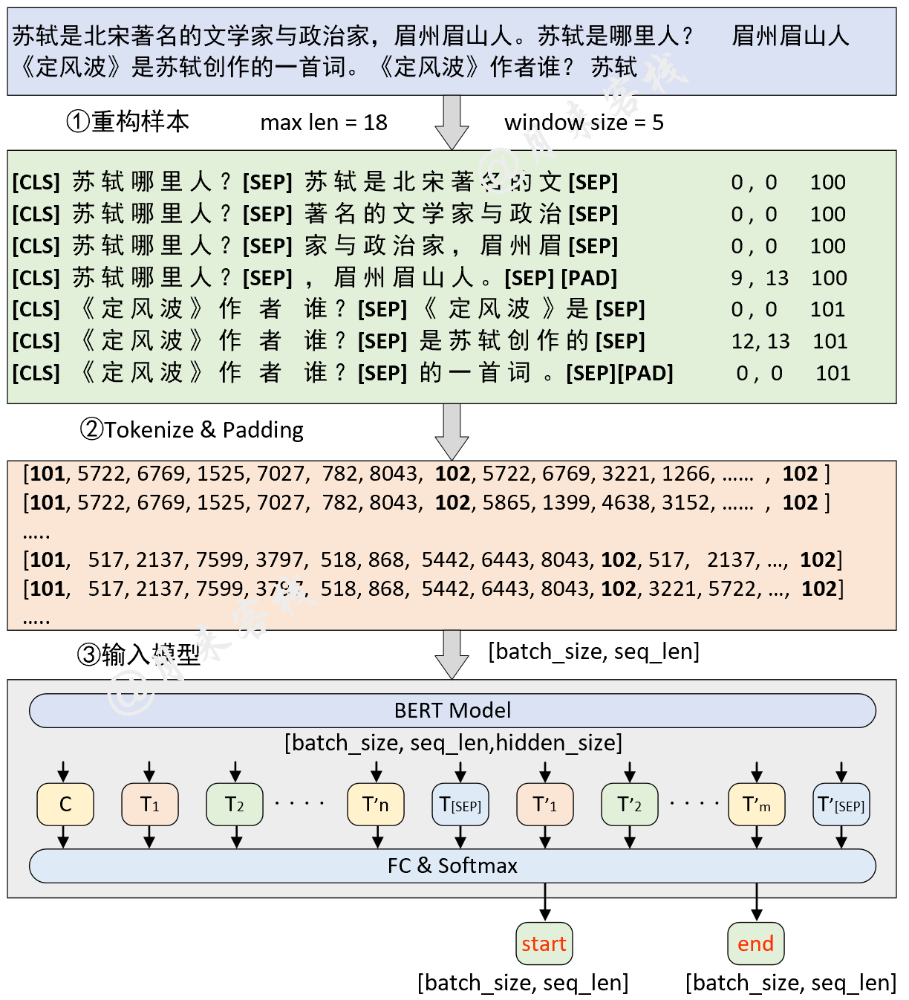

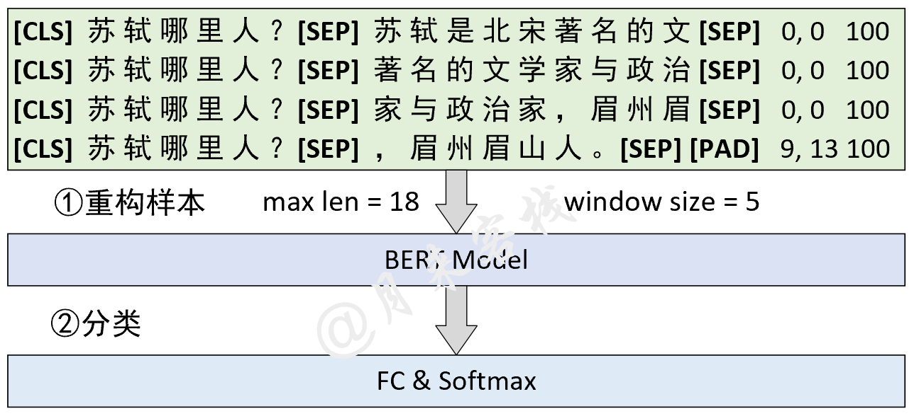

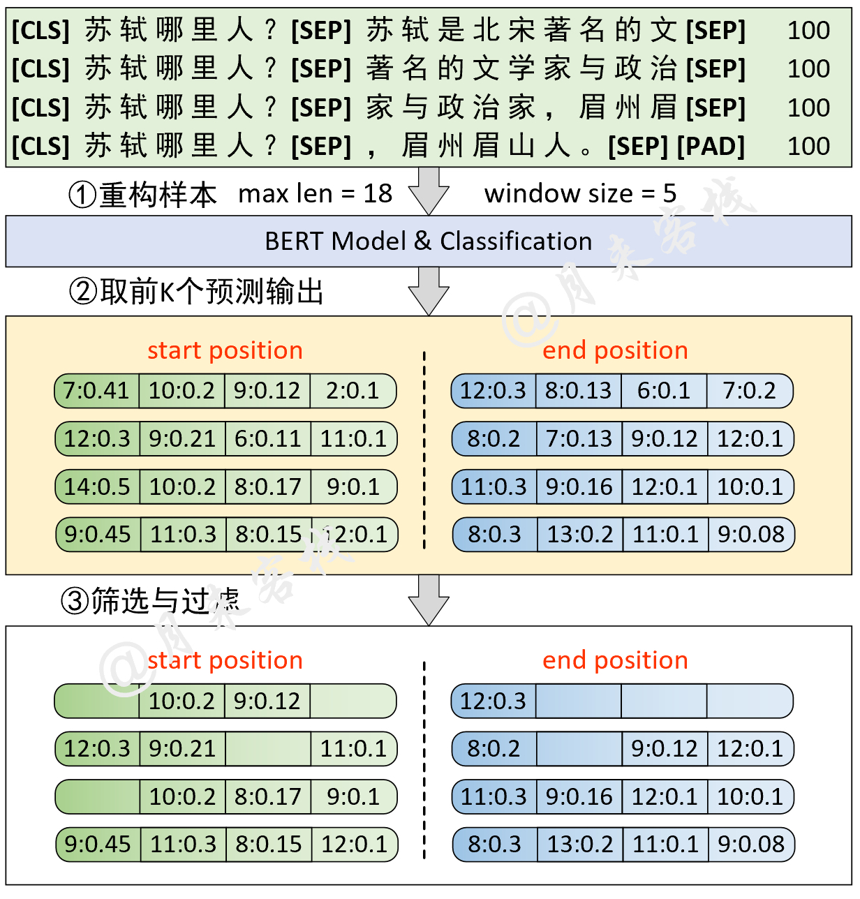

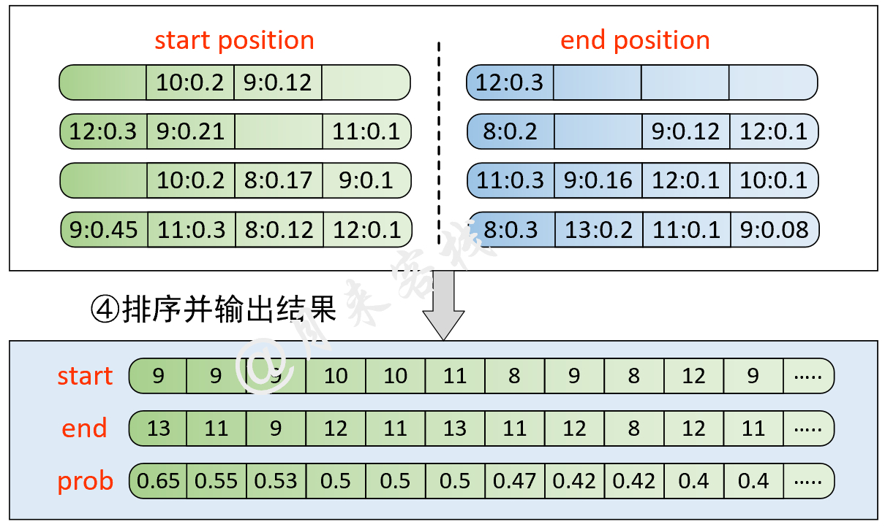

```python
python TaskForSQuADQuestionAnswering.py
```
运行结果：
```python
[2022-01-02 14:42:17]缓存文件 ~/BertWithPretrained/data/SQuAD/dev-v1_128_384_64.pt 不存在，重新处理并缓存！
[2022-01-02 14:42:17] - DEBUG: <<<<<<<<  进入新的example  >>>>>>>>>
[2022-01-02 14:42:17] - DEBUG: ## 正在预处理数据 utils.data_helpers is_training = False
[2022-01-02 14:42:17] - DEBUG: ## 问题 id: 56be5333acb8001400a5030d
[2022-01-02 14:42:17] - DEBUG: ## 原始问题 text: Which performers joined the headliner during the Super Bowl 50 halftime show?
[2022-01-02 14:42:17] - DEBUG: ## 原始描述 text: CBS broadcast Super Bowl 50 in the U.S., and charged an average of $5 million for a  ....
[2022-01-02 14:42:17]- DEBUG: ## 上下文长度为：87, 剩余长度 rest_len 为 ： 367
[2022-01-02 14:42:17] - DEBUG: ## input_tokens: ['[CLS]', 'which', 'performers', 'joined', 'the', 'headline', '##r', 'during', 'the', ...]
[2022-01-02 14:42:17] - DEBUG: ## input_ids:[101, 2029, 9567, 2587, 1996, 17653, 2099, 2076, 1996, 3565, 4605, 2753, 22589, 2265, 1029, 102, 6568, ....]
[2022-01-02 14:42:17] - DEBUG: ## segment ids:[0, 0, 0, 0, 0, 0, 0, 0, 0, 0, 0, 0, 0, 0, 0, 0, 1, 1, 1, 1, 1, 1, 1, 1, 1, 1, 1, 1, 1, 1, 1, 1, 1, 1, ...]
[2022-01-02 14:42:17] - DEBUG: ## orig_map:{16: 0, 17: 1, 18: 2, 19: 3, 20: 4, 21: 5, 22: 6, 23: 7, 24: 7, 25: 7, 26: 7, 27: 7, 28: 8, 29: 9, 30: 10,....}
[2022-01-02 14:42:17] - DEBUG: ======================
....
[2022-01-02 15:13:50] - INFO: Epoch:0, Batch[810/7387] Train loss: 0.998, Train acc: 0.708
[2022-01-02 15:13:55] - INFO: Epoch:0, Batch[820/7387] Train loss: 1.130, Train acc: 0.708
[2022-01-02 15:13:59] - INFO: Epoch:0, Batch[830/7387] Train loss: 1.960, Train acc: 0.375
[2022-01-02 15:14:04] - INFO: Epoch:0, Batch[840/7387] Train loss: 1.933, Train acc: 0.542
......
[2022-01-02 15:15:27] - INFO:  ### Quesiotn: [CLS] when was the first university in switzerland founded..
[2022-01-02 15:15:27] - INFO:    ## Predicted answer: 1460
[2022-01-02 15:15:27] - INFO:    ## True answer: 1460
[2022-01-02 15:15:27] - INFO:    ## True answer idx: (tensor(46, tensor(47))
[2022-01-02 15:15:27] - INFO:  ### Quesiotn: [CLS] how many wards in plymouth elect two councillors?
[2022-01-02 15:15:27] - INFO:    ## Predicted answer: 17 of which elect three .....
[2022-01-02 15:15:27] - INFO:    ## True answer: three
[2022-01-02 15:15:27] - INFO:    ## True answer idx: (tensor(25, tensor(25))
```
运行结束后，`data/SQuAD`目录中会生成一个名为`best_result.json`的预测文件，此时只需要切换到该目录下，并运行以下代码即可得到在`dev-v1.1.json`的测试结果：
```python
python evaluate-v1.1.py dev-v1.1.json best_result.json

"exact_match" : 80.879848628193, "f1": 88.338575234135
```

### 2.5 NSP与MLM任务训练及推理

模型结构与数据处理：

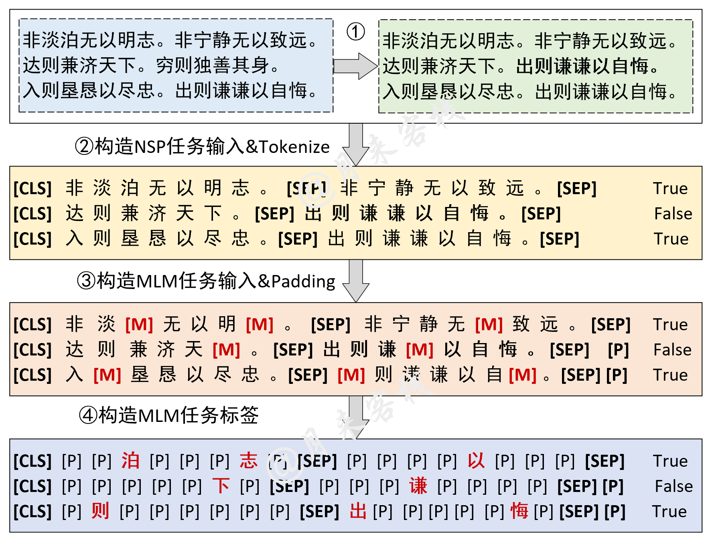

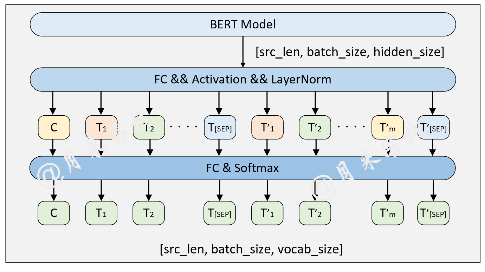

```python
if __name__ == '__main__':
    config = ModelConfig()
    train(config)
    sentences_1 = ["I no longer love her, true, but perhaps I love her.",
                   "Love is so short and oblivion so long."]

    sentences_2 = ["我住长江头，君住长江尾。",
                   "日日思君不见君，共饮长江水。",
                   "此水几时休，此恨何时已。",
                   "只愿君心似我心，定不负相思意。"]
    inference(config, sentences_2, masked=False, language='zh')
```

上述代码运行结束后将会看到类似如下所示的输出结果：
```python
- INFO: ## 成功载入已有模型进行推理……
- INFO:  ### 原始：我住长江头，君住长江尾。
- INFO:   ## 掩盖：我住长江头，[MASK]住长[MASK]尾。
- INFO:   ## 预测：我住长江头，君住长河尾。  
- INFO: ====================
- INFO:  ### 原始：日日思君不见君，共饮长江水。
- INFO:   ## 掩盖：日日思君不[MASK]君，共[MASK]长江水。
- INFO:   ## 预测：日日思君不见君，共饮长江水。
#   ......
```

### 2.6 命名体识别任务训练及推理

模型结构与数据处理：

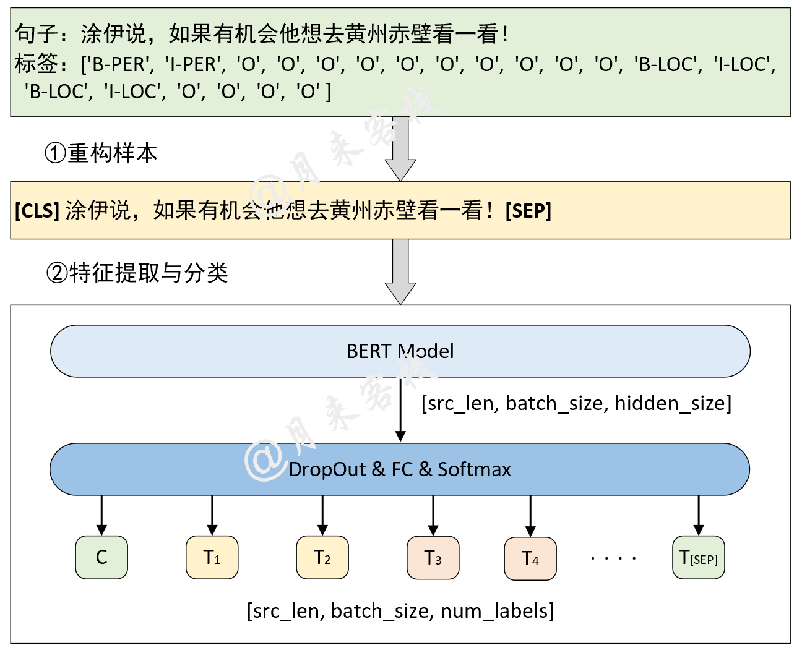


```python
if __name__ == '__main__':
    config = ModelConfig()
    train(config)
    sentences = ['智光拿出石壁拓文为乔峰详述事情始末，乔峰方知自己原本姓萧，乃契丹后族。',
                 '当乔峰问及带头大哥时，却发现智光大师已圆寂。',
                 '乔峰、阿朱相约找最后知情人康敏问完此事后，就到塞外骑马牧羊，再不回来。']
    inference(config, sentences)
```

上述代码运行结束后将会看到类似如下所示的输出结果：

```python
- INFO: Epoch: [1/10], Batch[620/1739], Train Loss: 0.115, Train acc: 0.96386
- INFO: Epoch: [1/10], Batch[240/1739], Train Loss: 0.098, Train acc: 0.96466
- INFO: Epoch: [1/10], Batch[660/1739], Train Loss: 0.087, Train acc: 0.96435
......
- INFO:句子：在澳大利亚等西方国家改变反倾销政策中对中国的划分后，不少欧盟人士也认识到，此种划分已背离中国经济迅速发展的现实。
- INFO: 澳大利亚：	LOC
- INFO: 中国：	LOC
- INFO: 欧盟：	LOC
- INFO: 中国： LOC
......
              precision    recall  f1-score   support

           O       1.00      0.99      1.00     97640
       B-ORG       0.86      0.93      0.89       984
       B-LOC       0.94      0.93      0.94      1934
       B-PER       0.97      0.97      0.97       884
       I-ORG       0.90      0.96      0.93      3945
       I-LOC       0.91      0.95      0.93      2556
       I-PER       0.99      0.98      0.98      1714

    accuracy                           0.99    109657
   macro avg       0.94      0.96      0.95    109657
weighted avg       0.99      0.99      0.99    109657
```

模型推理结果：
```python
- INFO: 句子：智光拿出石壁拓文为乔峰详述事情始末，乔峰方知自己原本姓萧，乃契丹后族。
- INFO: 	智光：	PER
- INFO: 	乔峰：	PER
- INFO: 	乔峰：	PER
- INFO: 	萧：	PER
- INFO: 	丹：	PER
......
```